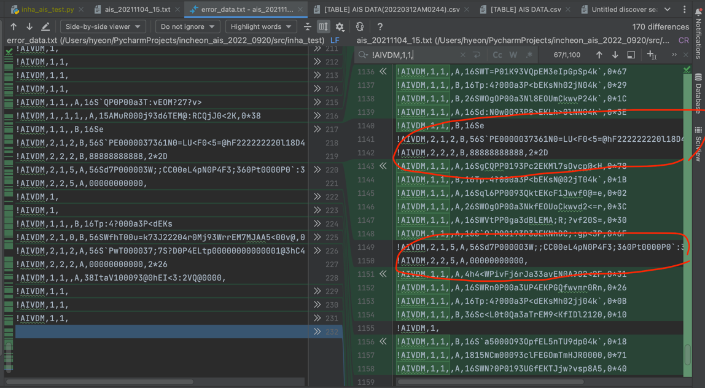

# 디코딩 확인
- 확인 파일 : ais_20211104_15
- 1,201개의 동적 AIS RAW DATA LOG

## 문제 개요
- 파일 내의 데이터 중, 디코딩시 문제가 발생한 갯수는 231개로 전체의 19.23% 수준
- 분류
  - 다중 메세지 해석에서 비롯 : 33%
  - 잘못된 형식 : 63%
  - 형변환에러 (체크섬 누락) : 4%
```json
디코딩 실패 갯수: 231
{
    "Missing fragment numbers: [2]": 42,
    "Missing fragment numbers: [1]": 34,
    "A NMEA message needs to have exactly 7 comma separated entries.": 145,
    "invalid literal for int() with base 10: '\\n'": 9,
    "invalid literal for int() with base 10: 'N'": 1
}
```

### pyais lib의 RAW DATA 검증코드
```python
def validate_message(msg: bytes) -> None:
    """
    Validates a given message.
    It checks if the messages complies with the AIS standard.
    It is based on:
        1. https://en.wikipedia.org/wiki/Automatic_identification_system
        2. https://en.wikipedia.org/wiki/NMEA_0183

    If not errors are found, nothing is returned.
    Otherwise an InvalidNMEAMessageException is raised.
    """
    values = msg.split(b",")

    # A message has exactly 7 comma separated values
    if len(values) != 7:
        raise InvalidNMEAMessageException(
            "A NMEA message needs to have exactly 7 comma separated entries."
        )

    # The only allowed blank value may be the message ID
    if not values[0]:
        raise InvalidNMEAMessageException(
            "The NMEA message type is empty!"
        )

    if not values[1]:
        raise InvalidNMEAMessageException(
            "Number of sentences is empty!"
        )

    if not values[2]:
        raise InvalidNMEAMessageException(
            "Sentence number is empty!"
        )

    if not values[5]:
        raise InvalidNMEAMessageException(
            "The NMEA message body (payload) is empty."
        )

    if not values[6]:
        raise InvalidNMEAMessageException(
            "NMEA checksum (NMEA 0183 Standard CRC16) is empty."
        )

    try:
        sentence_num = int(values[1])
        if sentence_num > 0xff:
            raise InvalidNMEAMessageException(
                "Number of sentences exceeds limit of 9 total sentences."
            )
    except ValueError:
        raise InvalidNMEAMessageException(
            "Invalid sentence number. No Number."
        )

    if values[2]:
        try:
            sentence_num = int(values[2])
            if sentence_num > 0xff:
                raise InvalidNMEAMessageException(
                    " Sentence number exceeds limit of 9 total sentences."
                )
        except ValueError:
            raise InvalidNMEAMessageException(
                "Invalid Sentence number. No Number."
            )

    if values[3]:
        try:
            sentence_num = int(values[3])
            if sentence_num > 0xff:
                raise InvalidNMEAMessageException(
                    "Number of sequential message ID exceeds limit of 9 total sentences."
                )
        except ValueError:
            raise InvalidNMEAMessageException(
                "Invalid  sequential message ID. No Number."
            )

    # It should not have more than 82 chars of payload
    if len(values[5]) > 82:
        raise InvalidNMEAMessageException(
            f"{msg.decode('utf-8')} has more than 82 characters of payload."
        )
```

## 문제 파악

### 다중 메세지 문제
- 다중 메세지로 구성된 ais raw data가 처리되지 못한 문제로
  - 다중 메세지들을 리스트 형태로 묶어주면 처리가 가능해진다.
  - 이 중 일부는 다중 메세지 중 일부가 누락되어 해석이 불가하다.
- 사진의 좌측이 디코딩 실패 데이터 모음이며, 우측은 원본 데이터 이다.
- 우측 원본 데이터에서 녹색으로 표시된 부분이 성공한 데이터인데, 성공 데이터 중 다중 프래그먼트로 구성된 메세지는 없었다.

- RAW DATA 예시
```json
!AIVDM,2,1,6,A,56;AG@82Fn188tiKB21PTr1PT4pN1QDF0h4r220t4BK2M6jbN@n@CU0BH888,0*50
!AIVDM,2,2,6,A,88888888880,2*22
!AIVDM,2,1,7,A,56SWWC0000037360R0<PV0<5=@hF2222222222000000040Ht00000000000,0*0A
!AIVDM,2,2,7,A,00000000000,2*23
!AIVDM,2,1,8,A,56SWo?00000373N0Vq<Tq=DpN0pvs40000000<b<1@G15400000000000000,0*6F
!AIVDM,2,2,8,A,00000000008,2*24
```

### 잘못된 형식
**Filed 갯수 맞지 않음**
- RAW DATA 예시
```
!AIVDM,1,1,
!AIVDM,1,1,,A
!AIVDM,1,1,,B
!AIVDM,2,2,2,A,00000000000,2*26
!AIVDM,1,1,,B,16S`9`P
```

**Filed 누락**
- 추측이 가능한 필드가 누락된 경우

**Payload 누락**
- Payload 항목이 없거나 일부만 존재하여 디코딩 불가

**Payload 중간에 , 존재**
```python
# 정상동작
!AIVDM,1,1,,A,16Sg>1000093mK<EGjNDDq9Ep8HpLIMDP?wH24kH,0*7C

# 오류발생 (필드 수 초과)
!AIVDM,1,1,,A,16Sg>1000093mK<EGjNDDq9Ep8Hp,LIMDP?wH24kH,0*7C
```

### 형변환 에러 (체크섬 누락)
- checksum 형변환 과정에서 오류 발생
- checksum 이 존재하나 int형으로 변환할 수 없을 때 형변환 오류 발생
- checksum은 raw data의 가장 뒤쪽에 위치하지만 해당 데이터가 없어 오류 발생
- RAW DATA 예
```json
!AIVDM,1,1,,B,16S`AJ0P0093QJLEKivu1ww600Rw,
!AIVDM,1,1,,B,16S`i5PP0093U>bEKU:@q?wMr<3O,
!AIVDM,1,1,,,V,N*64
```
- chk_to_int 함수
```python
def chk_to_int(chk_str: bytes) -> typing.Tuple[int, int]:
    """
    Converts a checksum string to a tuple of (fillbits, checksum).
    >>> chk_to_int(b"0*1B")
    (0, 27)
    """
    if not len(chk_str):
        return 0, -1

    fill_bits: int = int(chr(chk_str[0]))
    try:
        checksum = int(chk_str[2:], 16)
    except (IndexError, ValueError):
        checksum = -1
    return fill_bits, checksum
```

## 기타 확인 사항

### 체크섬 확인 안함 의심
아래 다섯 메세지 모두 checkSum이 다르지만 모두 정상적으로 디코딩됨
```python
!AIVDM,1,1,,A,16S`fAP000a3OsLEKwfmKB:L0@8g,0*55
!AIVDM,1,1,,A,16S`fAP000a3OsLEKwfmKB:L0@8g,0*15
!AIVDM,1,1,,A,16S`fAP000a3OsLEKwfmKB:L0@8g,0*10
!AIVDM,1,1,,A,16S`fAP000a3OsLEKwfmKB:L0@8g,0*1A
!AIVDM,1,1,,A,16S`fAP000a3OsLEKwfmKB:L0@8g,0*B5
```


